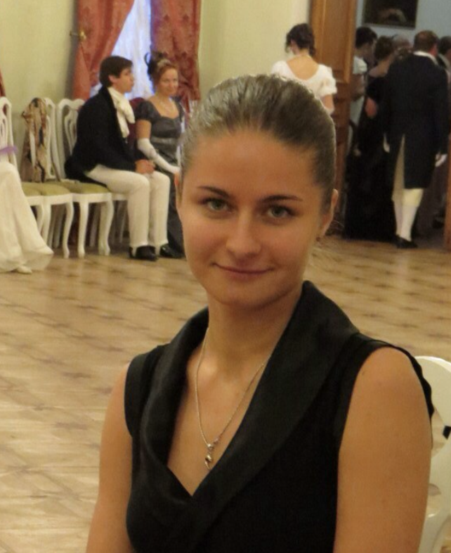
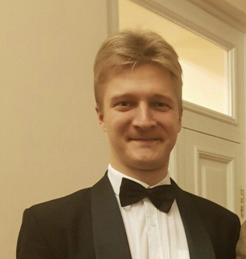
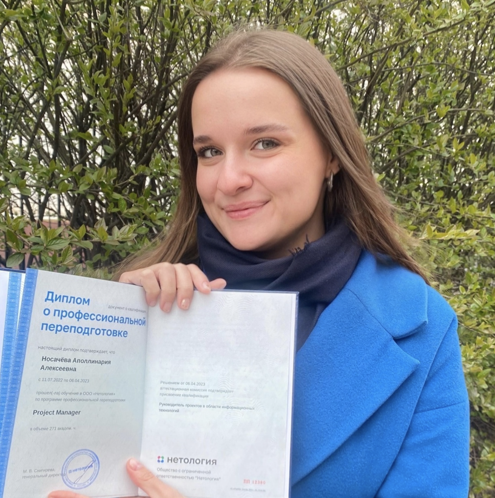

# Çàãîëîâîê
___
Îïèñàíèå 

>Îòíåñèñü ê ýòî ðàáîòå ñ óâàæåíèåì, - Godfather

___

|номер|фото| пол | борода | очки| музыкант оркестра ? |подтверждение|ссылка на фото|  
|---|---|---|---|---|---|---|---|
|1      |  |  Æ  |   íåò  |  íåò |      äà      | [LINK](https://orchestra47.ru/sostav/first-violins/)| [LINK](https://vk.com/id27939298)|
|2      |  |  Æ  |   íåò  |  íåò |      äà      | [LINK](https://orchestra47.ru/sostav/first-violins/)| [LINK](https://vk.com/id603857)|
|3      |  |  Ì  |   äà   |  íåò |      äà      | [LINK](https://orchestra47.ru/sostav/first-violins/)| [LINK](https://vk.com/starodubcevmusic)|
|4      |  |  Æ  |   íåò  |  íåò |      äà      | [LINK](https://orchestra47.ru/sostav/first-violins/)| [LINK](https://vk.com/orange_daria)|
|5      |  |  Æ  |   íåò  |  íåò |      äà      | [LINK](https://orchestra47.ru/sostav/first-violins/)| [LINK](https://vk.com/apollinariia)|
|6      |  |  Æ  |   íåò  |  íåò |      äà      | [LINK](https://orchestra47.ru/sostav/first-violins/)| [LINK](https://vk.com/podgorik)|
|7      |  |  Æ  |   íåò  |  íåò |      äà      | [LINK](https://orchestra47.ru/sostav/first-violins/)| [LINK](https://vk.com/koteika_katerina)|
|8      |  |  Ì  |   íåò  |  íåò |      äà      | [LINK](https://klassika-spb.ru/orkestr/sostav-simfonicheskogo-orkestra-klassika.html)| [LINK](https://vk.com/trumplan)|
|9      |  |  Æ  |   íåò  |  íåò |      äà      | [LINK](https://orchestra47.ru/sostav/second-violins/)| [LINK](https://orchestra47.ru/sostav/second-violins/)|
|10     | |  Æ  |   íåò  |  íåò |      äà      | [LINK](https://orchestra47.ru/sostav/second-violins/)| [LINK](https://orchestra47.ru/sostav/second-violins/)|
|11     | |  Æ  |   íåò  |  íåò |      äà      | [LINK](https://orchestra47.ru/sostav/second-violins/)| [LINK](https://orchestra47.ru/sostav/second-violins/)|
|12     | |  Æ  |   íåò  |  íåò |      äà      | [LINK](https://orchestra47.ru/sostav/second-violins/)| [LINK](https://orchestra47.ru/sostav/second-violins/)|
|13     | |  Æ  |   íåò  |  íåò |      äà      | [LINK](https://orchestra47.ru/sostav/second-violins/)| [LINK](https://orchestra47.ru/sostav/second-violins/)|
|14     | |  Æ  |   íåò  |  íåò |      äà      | [LINK](https://orchestra47.ru/sostav/second-violins/)| [LINK](https://vk.com/adriana.chuba10)|
|15     | |  Ì  |   äà   |  íåò |      äà      | [LINK](https://orchestra47.ru/sostav/first-violins/) | [LINK](https://vk.com/vdanilevskiy)|
|16     | |  Ì  |   íåò  |  íåò |      äà      | [LINK](https://orchestra47.ru/sostav/violas/)| [LINK](https://orchestra47.ru/sostav/violas/|
|17     | |  Æ  |   íåò  |  íåò |      äà      | [LINK](https://orchestra47.ru/sostav/violas/)| [LINK](https://orchestra47.ru/sostav/violas/|
|18     | |  Æ  |   íåò  |  íåò |      äà      | [LINK](https://orchestra47.ru/sostav/violas/)| [LINK](https://orchestra47.ru/sostav/violas/|
|19     | |  Æ  |   íåò  |  íåò |      äà      | [LINK](https://orchestra47.ru/sostav/violas/)| [LINK](https://vk.com/olgavasilevs)|
|20     | |  Æ  |   íåò  |  íåò |      äà      | [LINK](https://orchestra47.ru/sostav/violas/)| [LINK](https://vk.com/lina.brikova|
|21     | |  Ì  |   íåò  |  íåò |      äà      | [LINK](https://orchestra47.ru/sostav/cellos/)| [LINK](https://orchestra47.ru/sostav/cellos/|
|22     | |  Ì  |   äà   |  íåò |      äà      | [LINK](https://orchestra47.ru/sostav/cellos/)| [LINK](https://orchestra47.ru/sostav/cellos/)|
|23     | |  Ì  |   äà   |  äà  |      äà      | [LINK](https://orchestra47.ru/sostav/cellos/)| [LINK](https://vk.com/id_632876587923|
|24     | |  Æ  |   íåò  |  íåò |      äà      | [LINK](https://orchestra47.ru/sostav/cellos/)| [LINK](https://orchestra47.ru/sostav/cellos/)|
|25     | |  Æ  |   íåò  |  íåò |      äà      | [LINK](https://orchestra47.ru/sostav/cellos/)| [LINK](https://orchestra47.ru/sostav/cellos/)|
|26     | |  Æ  |   íåò  |  äà  |      äà      | [LINK](https://orchestra47.ru/sostav/cellos/)| [LINK](https://vk.com/lihoe_kalanchoe)|
|27     | |  Ì  |   íåò  |  äà  |      äà      | [LINK](https://orchestra47.ru/sostav/double-basses/)| [LINK](https://vk.com/maestrolenz)|
|28     | |  Æ  |   íåò  |  íåò |      äà      | [LINK](https://orchestra47.ru/sostav/double-basses/)| [LINK](https://orchestra47.ru/sostav/double-basses/)|
|29     | |  Æ  |   íåò  |  íåò |      äà      | [LINK](https://orchestra47.ru/sostav/flutes/)| [LINK](https://orchestra47.ru/sostav/flutes/)|
|30     | |  Æ  |   íåò  |  íåò |      äà      | [LINK](https://orchestra47.ru/sostav/flutes/)| [LINK](https://vk.com/a.shabronova)|
|31     | |  Ì  |   íåò  |  íåò |      äà      | [LINK](https://orchestra47.ru/sostav/oboes/)| [LINK](https://orchestra47.ru/sostav/oboes/)|
|32     | |  Æ  |   íåò  |  äà  |      äà      | [LINK](https://orchestra47.ru/sostav/oboes/)| [LINK](https://orchestra47.ru/sostav/oboes/)|
|33     | |  Ì  |   íåò  |  íåò |      äà      | [LINK](https://orchestra47.ru/sostav/Bassoons/)| [LINK](https://orchestra47.ru/sostav/Bassoons/)|
|34     | |  Ì  |   íåò  |  äà  |      äà      | [LINK](https://orchestra47.ru/sostav/clarinets/)| [LINK](https://orchestra47.ru/sostav/clarinets/)|
|35     | |  Ì  |   äà   |  íåò |      äà      | [LINK](https://orchestra47.ru/sostav/clarinets/)| [LINK](https://orchestra47.ru/sostav/clarinets/)|
|36     | |  Ì  |   äà   |  íåò |      äà      | [LINK](https://orchestra47.ru/sostav/clarinets/)| [LINK](https://vk.com/id1094145)|
|37     | |  Ì  |   íåò  |  íåò |      äà      | [LINK](https://orchestra47.ru/sostav/french-horns/)| [LINK](https://orchestra47.ru/sostav/french-horns/)|
|38     | |  Ì  |   íåò  |  íåò |      äà      | [LINK](https://orchestra47.ru/sostav/french-horns/)| [LINK](https://orchestra47.ru/sostav/french-horns/)|
|39     | |  Ì  |   íåò  |  íåò |      äà      | [LINK](https://orchestra47.ru/sostav/french-horns/)| [LINK](https://orchestra47.ru/sostav/french-horns/)|
|40     | |  Ì  |   íåò  |  íåò |      äà      | [LINK](https://orchestra47.ru/sostav/truby/)| [LINK](https://orchestra47.ru/sostav/truby/)|
|41     | |  Ì  |   äà   |  äà  |      äà      | [LINK](https://orchestra47.ru/sostav/truby/)| [LINK](https://orchestra47.ru/sostav/truby/)|
|42     | |  Ì  |   äà   |  íåò |      äà      | [LINK](https://orchestra47.ru/sostav/truby/)| [LINK](https://orchestra47.ru/sostav/truby/)|
|43     | |  Ì  |   äà   |  íåò |      äà      | [LINK](https://orchestra47.ru/sostav/truby/)| [LINK](https://orchestra47.ru/sostav/truby/)|
|44     | |  Ì  |   íåò  |  íåò |      äà      | [LINK](https://orchestra47.ru/sostav/trombones/)| [LINK](https://orchestra47.ru/sostav/trombones/)|
|45     | |  Ì  |   íåò  |  íåò |      äà      | [LINK](https://orchestra47.ru/sostav/trombones/)| [LINK](https://orchestra47.ru/sostav/trombones/)|
|46     | |  Ì  |   íåò  |  íåò |      äà      | [LINK](https://orchestra47.ru/sostav/trombones/)| [LINK](https://orchestra47.ru/sostav/trombones/)|
|47     | |  Ì  |   íåò  |  íåò |      äà      | [LINK](https://orchestra47.ru/sostav/trombones/)| [LINK](https://vk.com/uskovkarpinskiy)|
|48     | |  Ì  |   íåò  |  íåò |      äà      | [LINK](https://orchestra47.ru/sostav/percussion/)| [LINK](https://orchestra47.ru/sostav/percussion/)|
|49     | |  Ì  |   íåò  |  íåò |      äà      | [LINK](https://orchestra47.ru/sostav/percussion/)| [LINK](https://orchestra47.ru/sostav/percussion/)|
|50     | |  Ì  |   íåò  |  íåò |      äà      | [LINK](https://orchestra47.ru/sostav/percussion/)| [LINK](https://orchestra47.ru/sostav/percussion/)|
|51     | |  Ì  |   íåò  |  äà  |      äà      | [LINK](https://orchestra47.ru/sostav/percussion/)| [LINK](https://orchestra47.ru/sostav/percussion/)|
|52     | |  Ì  |   íåò  |  íåò |      äà      | [LINK](https://orchestra47.ru/sostav/percussion/)| [LINK](https://vk.com/id154774951)|
|53     | |  Ì  |   íåò  |  íåò |      äà      | [LINK](https://orchestra47.ru/sostav/percussion/)| [LINK](https://orchestra47.ru/sostav/percussion/)|
|54     | |  Æ  |   íåò  |  íåò |      äà      | [LINK](ttps://orchestra47.ru/sostav/Harp/)| [LINK](https://orchestra47.ru/sostav/Harp/)|
|55     | |  Æ  |   íåò  |  íåò |      äà      | [LINK](https://orchestra47.ru/sostav/Piano-and-celesta/)| [LINK](https://vk.com/sofia.kovtun)|
|56     | |  Ì  |   íåò  |  íåò |      äà      | [LINK](https://orchestra47.ru/sostav/Piano-and-celesta/)| [LINK](https://orchestra47.ru/sostav/Piano-and-celesta/)|
|57     | |  Æ  |   íåò  |  íåò |      äà      | [LINK](https://andreyev-orchestra.ru/kollektiv/)| [LINK](https://andreyev-orchestra.ru/kollektiv/domryi-malyie-i/inna-ulyanova-konczertmejster-gruppyi-malyix-domr.html)|
|58     | |  Æ  |   íåò  |  íåò |      äà      | [LINK](https://andreyev-orchestra.ru/kollektiv/)| [LINK](https://andreyev-orchestra.ru/kollektiv/domryi-malyie-i/tatyana-kostyanaya-solistka-orkestra.html)|
|59     | |  Æ  |   íåò  |  íåò |      äà      | [LINK](https://andreyev-orchestra.ru/kollektiv/)| [LINK](https://andreyev-orchestra.ru/kollektiv/domryi-malyie-i/mariya-gafarova.html)|
|60     | |  Æ  |   íåò  |  íåò |      äà      | [LINK](https://andreyev-orchestra.ru/kollektiv/)| [LINK](https://andreyev-orchestra.ru/kollektiv/domryi-malyie-i/anastasiya-fedoseenko-solistka-orkestra.html)|
|61     | |  Æ  |   íåò  |  íåò |      äà      | [LINK](https://andreyev-orchestra.ru/kollektiv/)| [LINK](https://andreyev-orchestra.ru/kollektiv/domryi-malyie-i/natalya-skobkina.html)|
|62     | |  Æ  |   íåò  |  íåò |      äà      | [LINK](https://andreyev-orchestra.ru/kollektiv/)| [LINK](https://andreyev-orchestra.ru/kollektiv/domryi-malyie-i/mariya-xrupenkova.html)|
|63     | |  Æ  |   íåò  |  íåò |      äà      | [LINK](https://andreyev-orchestra.ru/kollektiv/)| [LINK](https://andreyev-orchestra.ru/kollektiv/domryi-malyie-i/ekaterina-shirokova-solistka-orkestra.html)|
|64     | |  Æ  |   íåò  |  íåò |      äà      | [LINK](https://andreyev-orchestra.ru/kollektiv/)| [LINK](https://andreyev-orchestra.ru/kollektiv/domryi-malyie-i/evgeniya-nazina.html)|
|65     | |  Æ  |   íåò  |  íåò |      äà      | [LINK](https://andreyev-orchestra.ru/kollektiv/)| [LINK](https://andreyev-orchestra.ru/kollektiv/domryi-malyie-ii/ekaterina-sayapina-solistka-orkestra.html)|
|66     | |  Æ  |   íåò  |  íåò |      äà      | [LINK](https://andreyev-orchestra.ru/kollektiv/)| [LINK](https://andreyev-orchestra.ru/kollektiv/domryi-malyie-ii/irina-anashkina.html)|
|67     | |  Æ  |   íåò  |  íåò |      äà      | [LINK](https://andreyev-orchestra.ru/kollektiv/)| [LINK](https://andreyev-orchestra.ru/kollektiv/domryi-malyie-ii/yuliya-kovaleva.html)|
|68     | |  Æ  |   íåò  |  íåò |      äà      | [LINK](https://andreyev-orchestra.ru/kollektiv/)| [LINK](https://andreyev-orchestra.ru/kollektiv/domryi-malyie-ii/natalya-shhelovanova.html)|
|69     | |  Æ  |   íåò  |  äà  |      äà      | [LINK](https://andreyev-orchestra.ru/kollektiv/)| [LINK](https://andreyev-orchestra.ru/kollektiv/domryi-malyie-ii/inna-snigireva-konczertmejster-gruppyi-ii-malyix-domr.html)|
|70     | |  Æ  |   íåò  |  íåò |      äà      | [LINK](https://andreyev-orchestra.ru/kollektiv/)| [LINK](https://andreyev-orchestra.ru/kollektiv/domryi-malyie-ii/lyubov-gorodnaya-solistka-orkestra.html)|
|71     | |  Æ  |   íåò  |  íåò |      äà      | [LINK](https://andreyev-orchestra.ru/kollektiv/)| [LINK](https://andreyev-orchestra.ru/kollektiv/domryi-malyie-ii/anna-petrova.html)|
|72     | |  Æ  |   íåò  |  íåò |      äà      | [LINK](https://andreyev-orchestra.ru/kollektiv/)| [LINK](https://andreyev-orchestra.ru/kollektiv/domryi-malyie-ii/glafira-machikina.html)|
|73     | |  Æ  |   íåò  |  íåò |      äà      | [LINK](https://andreyev-orchestra.ru/kollektiv/)| [LINK](https://andreyev-orchestra.ru/kollektiv/domryi-altovyie-i/natalya-churina-solistka-orkestra.html)|
|74     | |  Æ  |   íåò  |  íåò |      äà      | [LINK](https://andreyev-orchestra.ru/kollektiv/)| [LINK](https://andreyev-orchestra.ru/kollektiv/domryi-altovyie-i/elena-korobejnikova-solistka-orkestra.html)|
|75     | |  Æ  |   íåò  |  íåò |      äà      | [LINK](https://andreyev-orchestra.ru/kollektiv/)| [LINK](https://andreyev-orchestra.ru/kollektiv/domryi-altovyie-i/galina-trushkova.html)|
|76     | |  Æ  |   íåò  |  íåò |      äà      | [LINK](https://andreyev-orchestra.ru/kollektiv/)| [LINK](https://andreyev-orchestra.ru/kollektiv/domryi-altovyie-i/ekaterina-lomova-solistka-orkestra.html)|
|77     | |  Ì  |   íåò  |  íåò |      äà      | [LINK](https://andreyev-orchestra.ru/kollektiv/)| [LINK](https://andreyev-orchestra.ru/kollektiv/domryi-altovyie-i/ivan-amolin-solist-orkestra.html)|
|78     | |  Æ  |   íåò  |  íåò |      äà      | [LINK](https://andreyev-orchestra.ru/kollektiv/)| [LINK](https://andreyev-orchestra.ru/kollektiv/domryi-altovyie-i/svetlana-smolyar-konczertmejster-gruppyi-altovyix-domr,-solistka-orkestra.html)|
|79     | |  Æ  |   íåò  |  íåò |      äà      | [LINK](https://andreyev-orchestra.ru/kollektiv/)| [LINK](https://andreyev-orchestra.ru/kollektiv/domryi-altovyie-ii/elena-dernova-konczertmejster-gruppyi-ii-altovyix-domr.html)|
|80     | |  Æ  |   íåò  |  íåò |      äà      | [LINK](https://andreyev-orchestra.ru/kollektiv/)| [LINK](https://andreyev-orchestra.ru/kollektiv/domryi-altovyie-ii/mariya-shelexan.html)|
|81     | |  Ì  |   äà   |  íåò |      äà      | [LINK](https://andreyev-orchestra.ru/kollektiv/)| [LINK](https://andreyev-orchestra.ru/kollektiv/domryi-bas-i/nikita-yakovlev-solist-orkestra.html)|
|82     | |  Ì  |   íåò  |  íåò |      äà      | [LINK](https://andreyev-orchestra.ru/kollektiv/)| [LINK](https://andreyev-orchestra.ru/kollektiv/balalajki-primyi/aleksandr-shhipiczin-zasluzhennyij-artist-rossii,-konczertmejster-gruppyi-balalaek-prim,-solist-orkestra.html)|
|83     | |  Ì  |   íåò  |  íåò |      äà      | [LINK](https://andreyev-orchestra.ru/kollektiv/)| [LINK](https://andreyev-orchestra.ru/kollektiv/balalajki-primyi/oleg-gafarov-solist-orkestra.html)|
|84     | |  Ì  |   íåò  |  íåò |      äà      | [LINK](https://andreyev-orchestra.ru/kollektiv/)| [LINK](https://andreyev-orchestra.ru/kollektiv/balalajki-primyi/rustam-gafarov-solist-orkestra.html)|
|85     | |  Ì  |   íåò  |  íåò |      äà      | [LINK](https://andreyev-orchestra.ru/kollektiv/)| [LINK](https://andreyev-orchestra.ru/kollektiv/balalajki-primyi/aleksej-chugunov.html)|
|86     | |  Ì  |   íåò  |  íåò |      äà      | [LINK](https://andreyev-orchestra.ru/kollektiv/)| [LINK](https://andreyev-orchestra.ru/kollektiv/balalajki-primyi/sergej-gamarcz-solist-orkestra.html)|
|87     | |  Ì  |   íåò  |  íåò |      äà      | [LINK](https://andreyev-orchestra.ru/kollektiv/)| [LINK](https://andreyev-orchestra.ru/kollektiv/balalajki-primyi/aleksandr-milyutin-solist-orkestra.html)|
|88     | |  Ì  |   íåò  |  íåò |      äà      | [LINK](https://andreyev-orchestra.ru/kollektiv/)| [LINK](https://andreyev-orchestra.ru/kollektiv/balalajki-sekundyi/sergej-mixeev.html)|
|89     | |  Ì  |   íåò  |  íåò |      äà      | [LINK](https://andreyev-orchestra.ru/kollektiv/)| [LINK](https://andreyev-orchestra.ru/kollektiv/balalajki-kontrabas/sergej-fedoseenko.html)|
|90     ||  Ì  |   íåò  |  íåò |      äà      | [LINK](https://andreyev-orchestra.ru/kollektiv/)| [LINK](https://vk.com/id416714307)|
|91     | |  Ì  |   íåò  |  íåò |      äà      | [LINK](https://andreyev-orchestra.ru/kollektiv/)| [LINK](https://andreyev-orchestra.ru/kollektiv/balalajki-kontrabas/leonid-varganov.html)|
|92     | |  Ì  |   äà   |  äà  |      äà      | [LINK](https://andreyev-orchestra.ru/kollektiv/)| [LINK](https://andreyev-orchestra.ru/kollektiv/balalajki-kontrabas/andrej-kotyagin.html)|
|93     ||  Ì  |   äà   |  íåò |      äà      | [LINK](https://andreyev-orchestra.ru/kollektiv/)| [LINK](https://vk.com/yaroslavkotlov)|
|94     | |  Ì  |   íåò  |  íåò |      äà      | [LINK](https://andreyev-orchestra.ru/kollektiv/)| [LINK](https://andreyev-orchestra.ru/kollektiv/flejtyi/anton-yaroshenko.html)|
|95     | |  Ì  |   äà   |  íåò |      äà      | [LINK](https://andreyev-orchestra.ru/kollektiv/)| [LINK](https://andreyev-orchestra.ru/kollektiv/flejtyi/vladimir-fonin-zasluzhennyij-artist-rossii,-solist-orkestra.html)|
|96     | |  Ì  |   íåò  |  íåò |      äà      | [LINK](https://andreyev-orchestra.ru/kollektiv/)| [LINK](https://andreyev-orchestra.ru/kollektiv/flejtyi/roman-mamin.html)|
|97     | |  Ì  |   äà   |  íåò |      äà      | [LINK](https://andreyev-orchestra.ru/kollektiv/)| [LINK](https://andreyev-orchestra.ru/kollektiv/flejtyi/konstantin-navalov.html)|
|98     | |  Ì  |   äà   |  íåò |      äà      | [LINK](https://andreyev-orchestra.ru/kollektiv/)| [LINK](https://andreyev-orchestra.ru/kollektiv/udarnyie/stanislav-grigorenko.html)|
|99     | |  Ì  |   íåò  |  íåò |      äà      | [LINK](https://andreyev-orchestra.ru/kollektiv/)| [LINK](https://andreyev-orchestra.ru/kollektiv/udarnyie/dmitrij-mironov-solist-orkestra.html)|
|100    ||  Ì  |   íåò  |  íåò |      äà      | [LINK](https://andreyev-orchestra.ru/kollektiv/)| [LINK](https://andreyev-orchestra.ru/kollektiv/dirizhori/ivan-ivanovich-ivanov.html)|
