# Описание фотографий

| # | Фотография | Пол | Борода | Очки | музыкант СО? | Источник данных о СО | Источник фото |
|---|---|---|---|---|---|---|---|
|1      |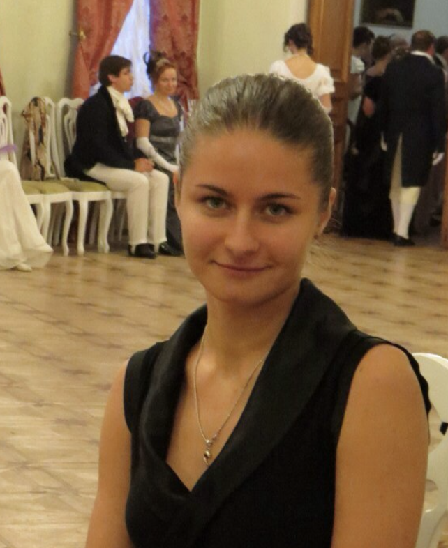  |  Æ  |   íåò  |  íåò |      äà      | [LINK](https://orchestra47.ru/sostav/first-violins/)| [LINK](https://vk.com/id27939298)|
|2      |  |  Æ  |   íåò  |  íåò |      äà      | [LINK](https://orchestra47.ru/sostav/first-violins/)| [LINK](https://vk.com/id603857)|
|3      |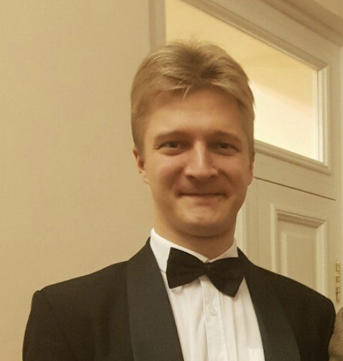  |  Ì  |   äà   |  íåò |      äà      | [LINK](https://orchestra47.ru/sostav/first-violins/)| [LINK](https://vk.com/starodubcevmusic)|
|4      |  |  Æ  |   íåò  |  íåò |      äà      | [LINK](https://orchestra47.ru/sostav/first-violins/)| [LINK](https://vk.com/orange_daria)|
|5      |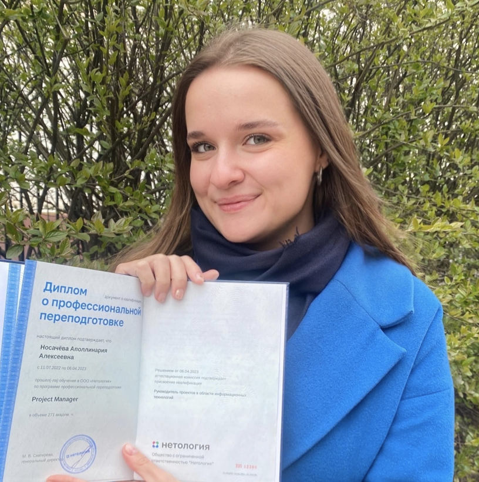  |  Æ  |   íåò  |  íåò |      äà      | [LINK](https://orchestra47.ru/sostav/first-violins/)| [LINK](https://vk.com/apollinariia)|
|6      |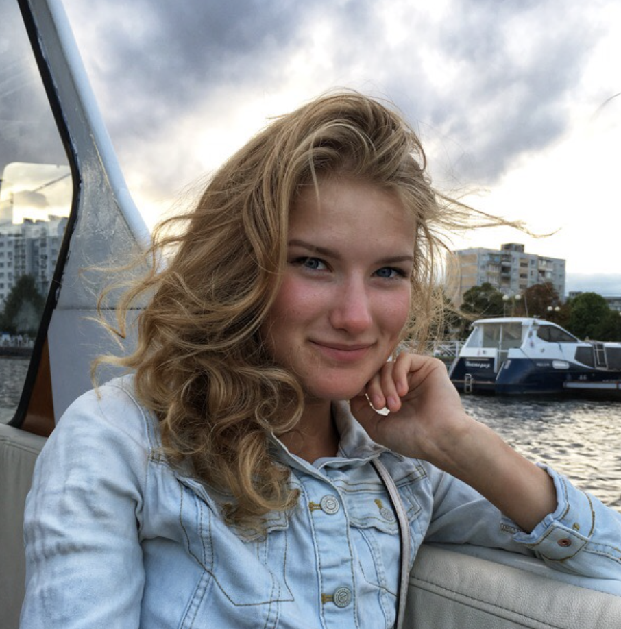  |  Æ  |   íåò  |  íåò |      äà      | [LINK](https://orchestra47.ru/sostav/first-violins/)| [LINK](https://vk.com/podgorik)|
|7      |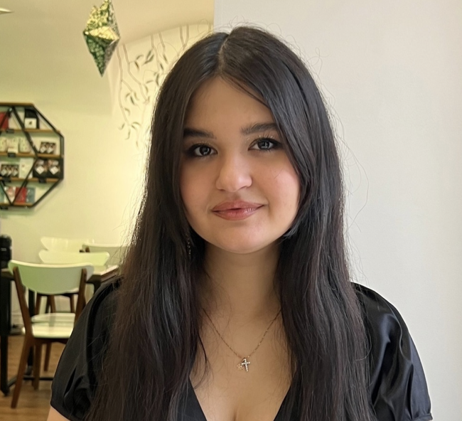  |  Æ  |   íåò  |  íåò |      äà      | [LINK](https://orchestra47.ru/sostav/first-violins/)| [LINK](https://vk.com/koteika_katerina)|
|8      |  |  Ì  |   íåò  |  íåò |      äà      | [LINK](https://klassika-spb.ru/orkestr/sostav-simfonicheskogo-orkestra-klassika.html)| [LINK](https://vk.com/trumplan)|
|9      |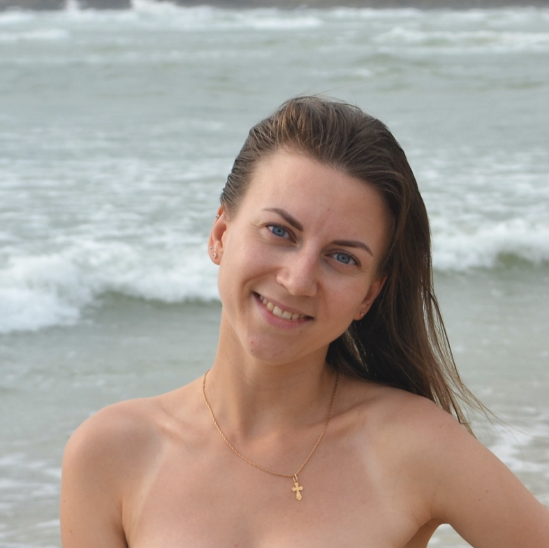  |  Æ  |   íåò  |  íåò |      äà      | [LINK](https://orchestra47.ru/sostav/second-violins/)| [LINK](https://vk.com/natusya1991)|
|10     | |  Æ  |   íåò  |  íåò |      äà      | [LINK](https://orchestra47.ru/sostav/second-violins/)| [LINK](https://vk.com/id418558015)|
|11     | |  Æ  |   íåò  |  íåò |      äà      | [LINK](https://orchestra47.ru/sostav/second-violins/)| [LINK](https://vk.com/aspr_hbc)|
|12     | |  Æ  |   íåò  |  íåò |      äà      | [LINK](https://orchestra47.ru/sostav/second-violins/)| [LINK](https://vk.com/yanamir_1995)|
|13     |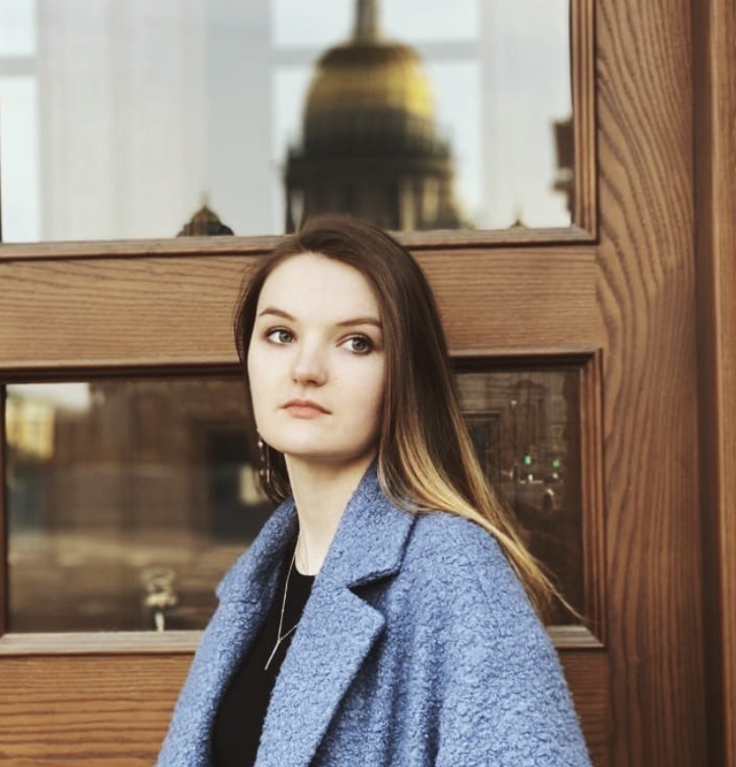 |  Æ  |   íåò  |  íåò |      äà      | [LINK](https://orchestra47.ru/sostav/second-violins/)| [LINK](https://vk.com/id73239154)|
|14     |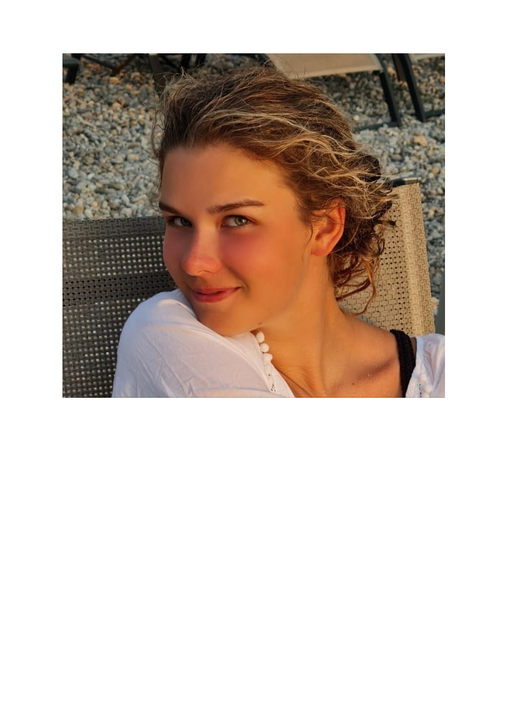 |  Æ  |   íåò  |  íåò |      äà      | [LINK](https://orchestra47.ru/sostav/second-violins/)| [LINK](https://vk.com/adriana.chuba10)|
|15     | |  Ì  |   äà   |  íåò |      äà      | [LINK](https://orchestra47.ru/sostav/first-violins/) | [LINK](https://vk.com/vdanilevskiy)|
|16     |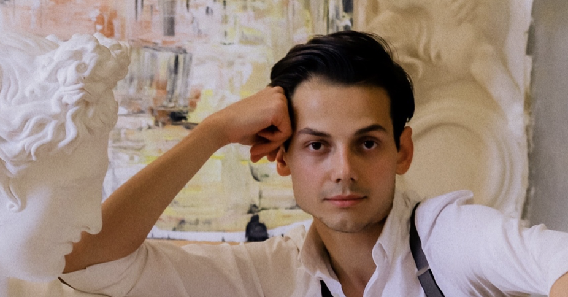 |  Ì  |   íåò  |  íåò |      äà      | [LINK](https://orchestra47.ru/sostav/violas/)| [LINK](https://vk.com/viagabekov)|
|17     |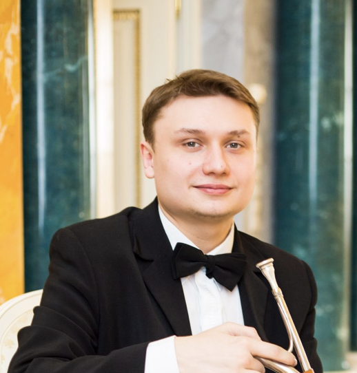 |  Ì  |   íåò  |  íåò |      äà      | [LINK](https://orchestra47.ru/sostav/french-horns/)| [LINK](https://vk.com/id16513947)| 
|18     |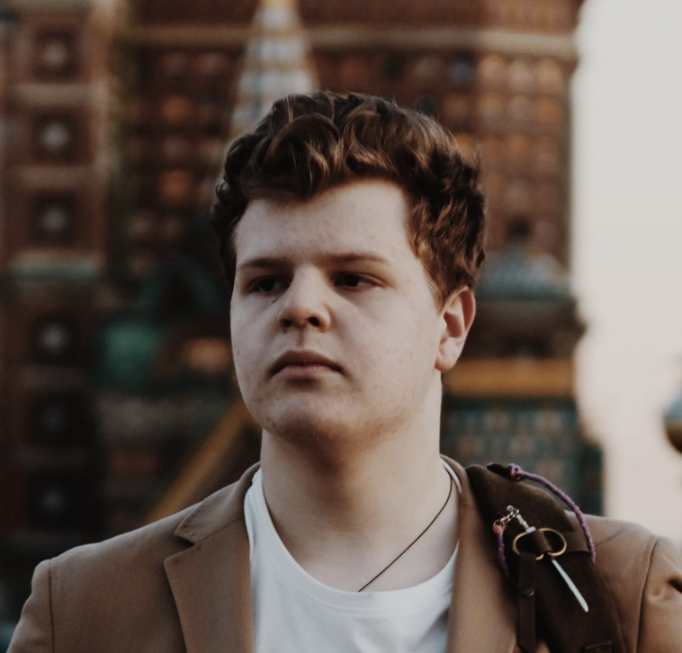 |  Ì  |   íåò  |  íåò |      äà      | [LINK](https://orchestra47.ru/sostav/truby/)| [LINK](https://vk.com/vasialeshenko)|
|19     | |  Æ  |   íåò  |  íåò |      äà      | [LINK](https://orchestra47.ru/sostav/violas/)| [LINK](https://vk.com/olgavasilevs)|
|20     | |  Æ  |   íåò  |  íåò |      äà      | [LINK](https://orchestra47.ru/sostav/violas/)| [LINK](https://vk.com/lina.brikova)|
|21     | |  Ì  |   íåò  |  íåò |      äà      | [LINK](https://orchestra47.ru/sostav/cellos/)| [LINK](https://vk.com/kikka)|
|22     |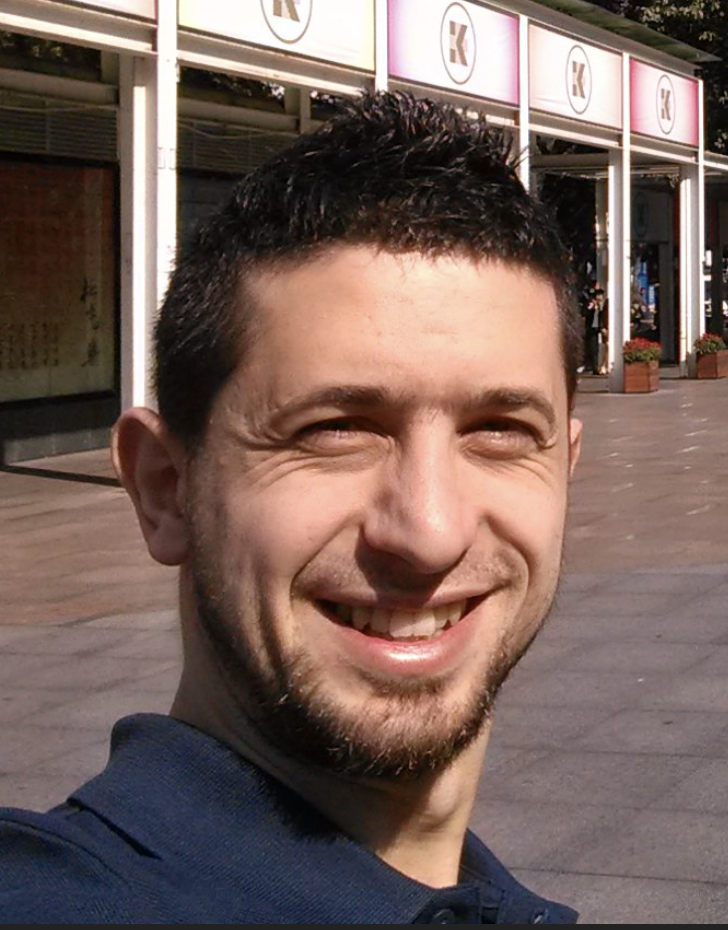 |  Ì  |   äà   |  íåò |      äà      | [LINK](https://orchestra47.ru/sostav/cellos/)| [LINK](https://vk.com/igor_botvin)|
|23     | |  Ì  |   äà   |  äà  |      äà      | [LINK](https://orchestra47.ru/sostav/cellos/)| [LINK](https://vk.com/id_632876587923)|
|24     | |  Ì  |   íåò  |  íåò |      äà      | [LINK](https://orchestra47.ru/sostav/trombones/)| [LINK](https://vk.com/id176752890)|
|25     | |  Ì  |   íåò  |  íåò |      äà      | [LINK](https://orchestra47.ru/sostav/tuba/)| [LINK](https://vk.com/id5304350)|
|26     | |  Æ  |   íåò  |  äà  |      äà      | [LINK](https://orchestra47.ru/sostav/cellos/)| [LINK](https://vk.com/lihoe_kalanchoe)|
|27     |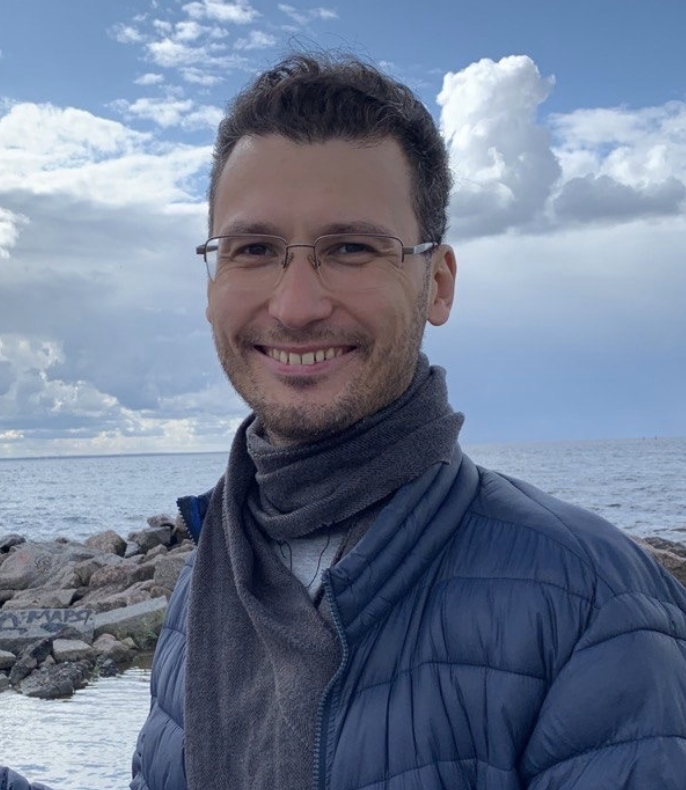 |  Ì  |   íåò  |  äà  |      äà      | [LINK](https://orchestra47.ru/sostav/double-basses/)| [LINK](https://vk.com/maestrolenz)|
|28     | |  Æ  |   íåò  |  íåò |      äà      | [LINK](https://orchestra47.ru/sostav/flutes/)| [LINK](https://vk.com/a.shabronova)|
|29     | |  Ì  |   íåò  |  íåò |      äà      | [LINK](https://orchestra47.ru/sostav/trombones/)| [LINK](https://vk.com/i1cooperson)|
|30     |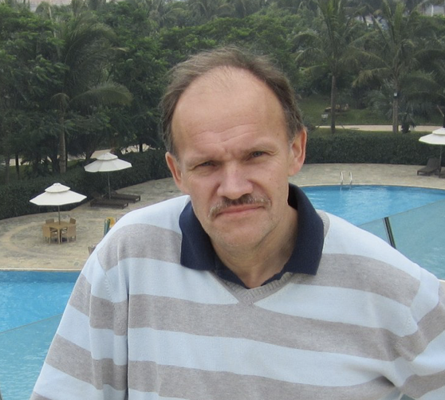 |  Ì  |   íåò  |  íåò |      äà      | [LINK](https://andreyev-orchestra.ru/kollektiv/balalajki-primyi/aleksandr-shhipiczin-zasluzhennyij-artist-rossii,-konczertmejster-gruppyi-balalaek-prim,-solist-orkestra.html)| [LINK](https://vk.com/id59126200)|
|31     | |  Ì  |   íåò  |  íåò |      äà      | [LINK](https://orchestra47.ru/sostav/oboes/)| [LINK](https://vk.com/alexeygolovin)|
|32     |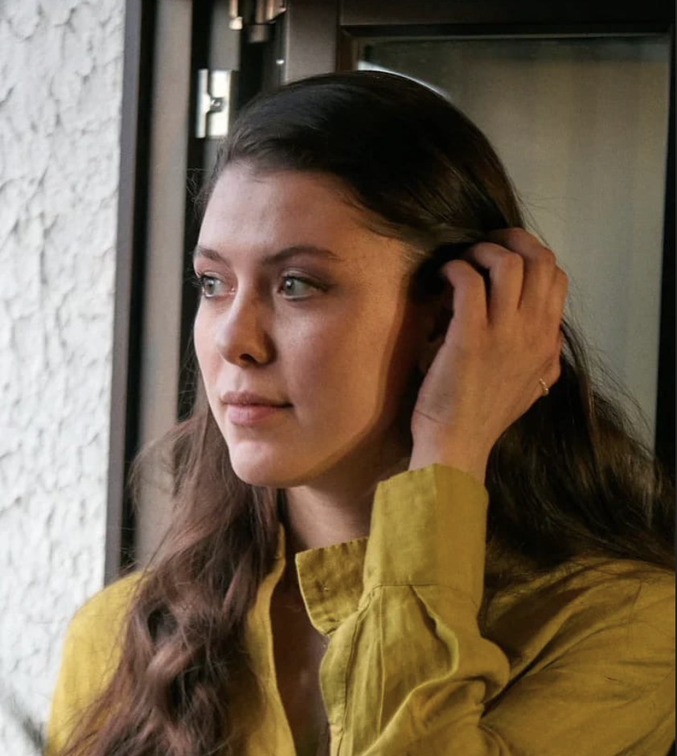 |  Æ  |   íåò  |  äà  |      äà      | [LINK](https://orchestra47.ru/sostav/flutes/)| [LINK](https://vk.com/albums217461755)|
|33     |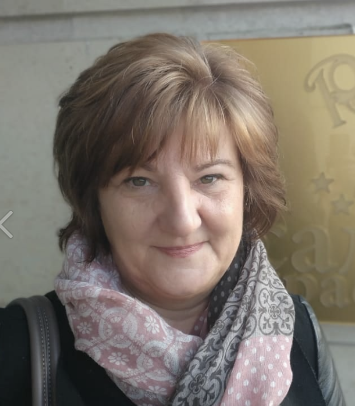 |  Ì  |   íåò  |  íåò |      äà      | [LINK](https://andreyev-orchestra.ru/kollektiv/domryi-altovyie-ii/elena-dernova-konczertmejster-gruppyi-ii-altovyix-domr.html)| [LINK](https://vk.com/elenadernova)|
|34     |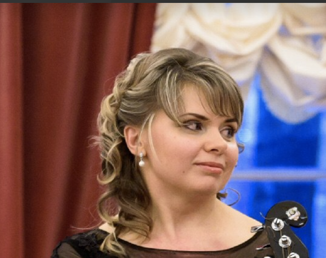 |  Ì  |   íåò  |  íåò |      äà      | [LINK](https://andreyev-orchestra.ru/kollektiv/domryi-altovyie-i/svetlana-smolyar-konczertmejster-gruppyi-altovyix-domr,-solistka-orkestra.html)| [LINK](https://vk.com/smsmusic)|
|35     |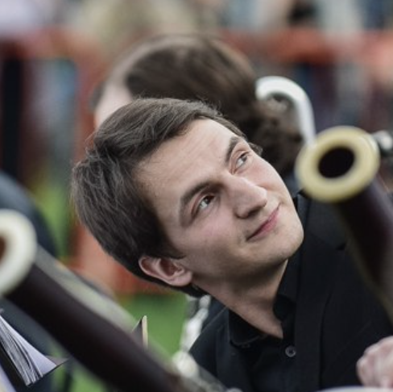 |  Ì  |   äà   |  íåò |      äà      | [LINK](https://orchestra47.ru/sostav/clarinets/)| [LINK](https://vk.com/savela_la)|
|36     |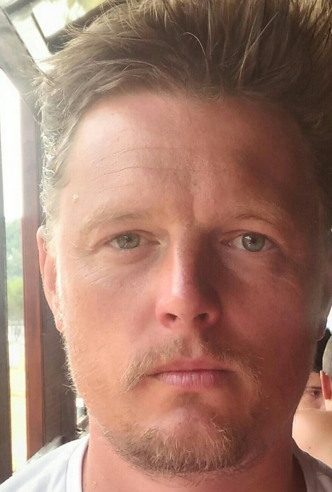 |  Ì  |   äà   |  íåò |      äà      | [LINK](https://orchestra47.ru/sostav/clarinets/)| [LINK](https://vk.com/id1094145)| 
|37     |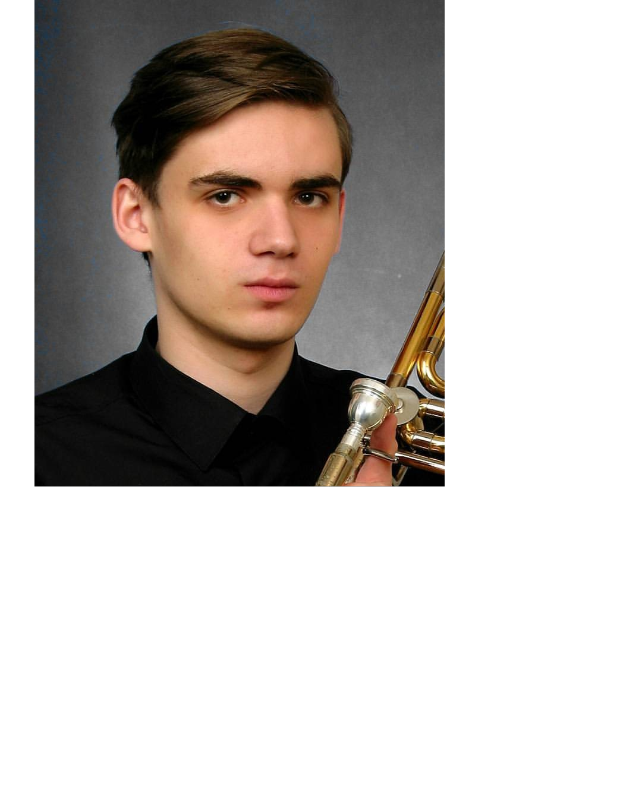 |  Ì  |   íåò  |  íåò |      äà      | [LINK](https://orchestra47.ru/sostav/trombones/)| [LINK](https://vk.com/uskovkarpinskiy)|
|38     | |  Ì  |   íåò  |  íåò |      äà      | [LINK](https://orchestra47.ru/sostav/percussion/)| [LINK](https://vk.com/id282339730)|
|39     |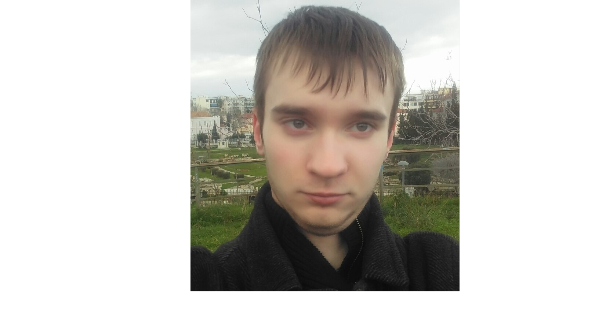 |  Ì  |   íåò  |  íåò |      äà      | [LINK](https://orchestra47.ru/sostav/percussion/)| [LINK](https://vk.com/id154774951)
|40     | |  Ì  |   íåò  |  íåò |      äà      | [LINK](https://orchestra47.ru/sostav/percussion/)| [LINK](https://vk.com/id797377)|
|41     |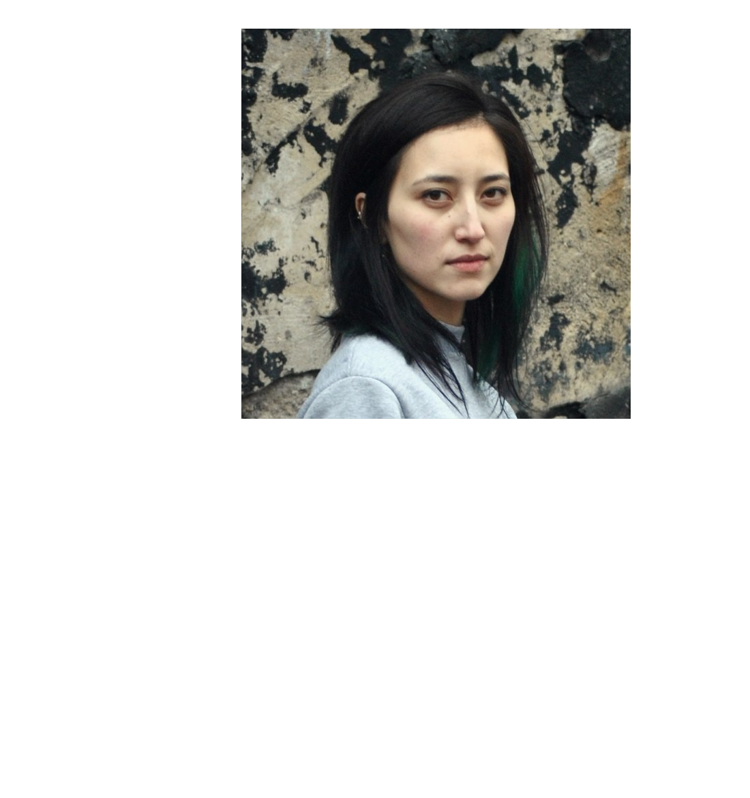 |  Æ  |   íåò  |  íåò |      äà      | [LINK](https://orchestra47.ru/sostav/Piano-and-celesta/)| [LINK](https://vk.com/sofia.kovtun)|
|42     | |  Ì  |   íåò  |  íåò |      äà      | [LINK](https://orchestra47.ru/sostav/Piano-and-celesta/)| [LINK](https://vk.com/symangram)|
|43     | |  Æ  |   íåò  |  íåò |      äà      | [LINK](https://andreyev-orchestra.ru/kollektiv/domryi-malyie-i/inna-ulyanova-konczertmejster-gruppyi-malyix-domr.html)| [LINK](https://vk.com/gladovskaya)|
|44     |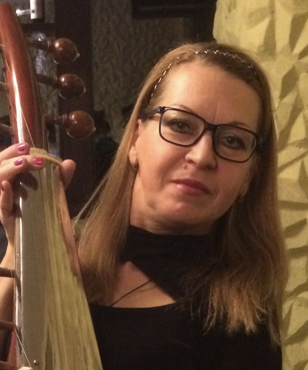 |  Æ  |   íåò  |  äà  |      äà      | [LINK](https://andreyev-orchestra.ru/kollektiv/domryi-malyie-i/tatyana-kostyanaya-solistka-orkestra.html)| [LINK](https://vk.com/id411985863)|
|45     |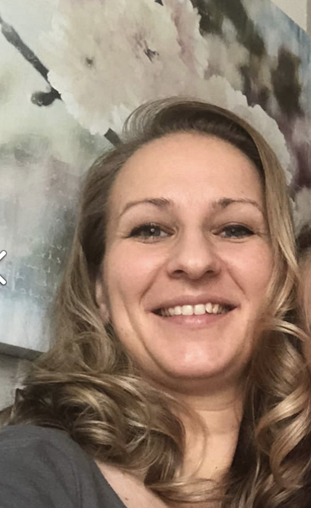 |  Æ  |   íåò  |  íåò |      äà      | [LINK](https://andreyev-orchestra.ru/kollektiv/domryi-malyie-i/mariya-gafarova.html)| [LINK](https://vk.com/marias79)|
|46     | |  Æ  |   íåò  |  íåò |      äà      | [LINK](https://andreyev-orchestra.ru/kollektiv/domryi-malyie-i/natalya-skobkina.html)| [LINK](https://vk.com/vizagnataliaskobkina)|
|47     |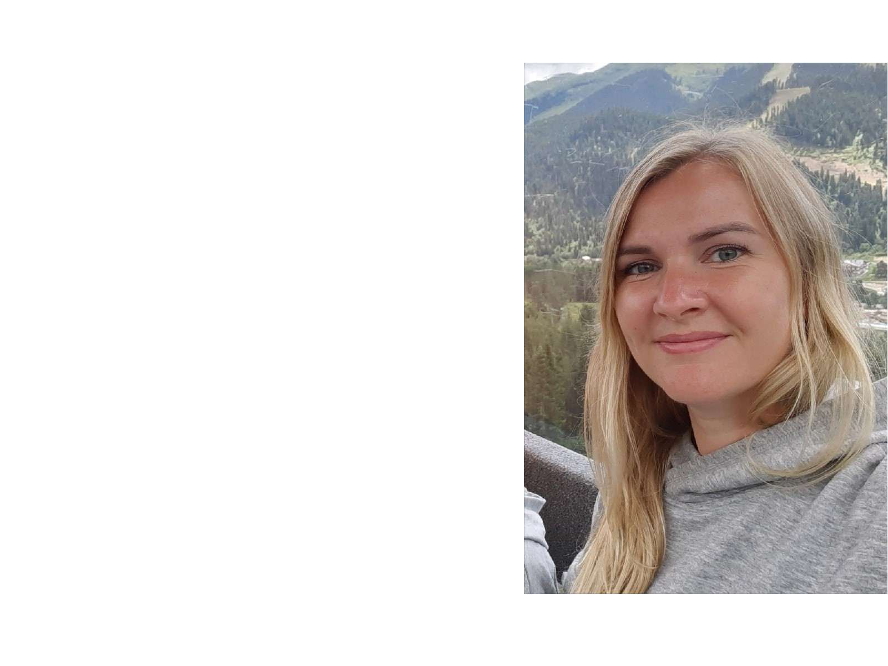 |  Æ  |   íåò  |  íåò |      äà      | [LINK](https://andreyev-orchestra.ru/kollektiv/domryi-malyie-i/anastasiya-fedoseenko-solistka-orkestra.html)| [LINK](https://vk.com/afedoseenko)|
|48     |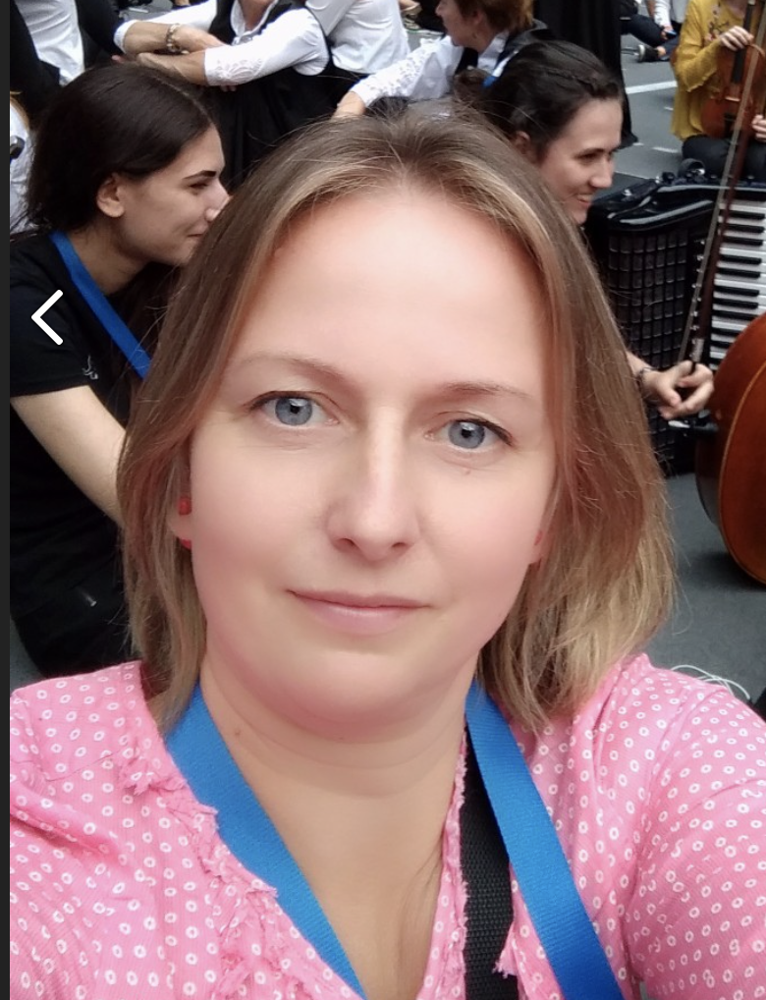 |  Æ  |   íåò  |  íåò |      äà      | [LINK](https://andreyev-orchestra.ru/kollektiv/domryi-malyie-i/mariya-xrupenkova.html)| [LINK](https://vk.com/id2451905)|
|49     |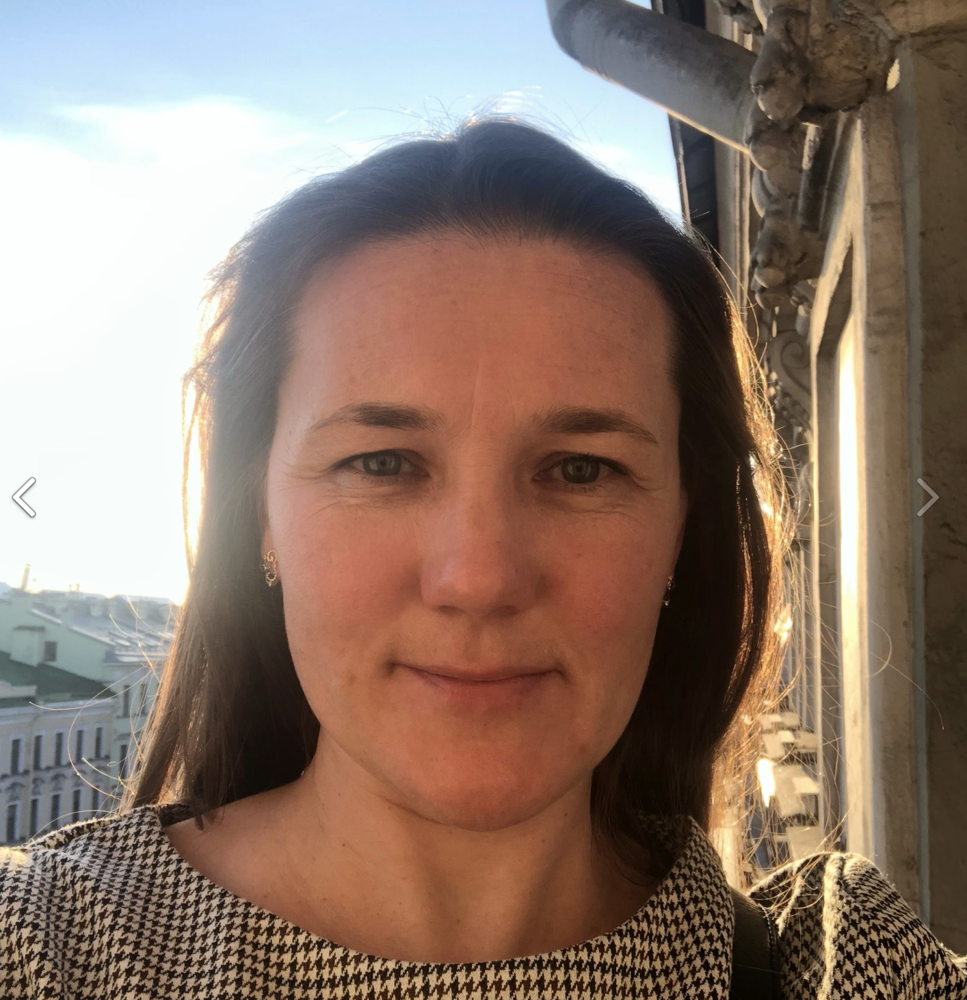 |  Æ  |   íåò  |  íåò |      äà      | [LINK](https://andreyev-orchestra.ru/kollektiv/domryi-malyie-i/ekaterina-shirokova-solistka-orkestra.html)| [LINK](https://vk.com/ekaterinashir)|
|50     | |  Æ  |   íåò  |  íåò |      äà      | [LINK](https://andreyev-orchestra.ru/kollektiv/domryi-malyie-ii/irina-anashkina.html)| [LINK](https://vk.com/id220091345)|
